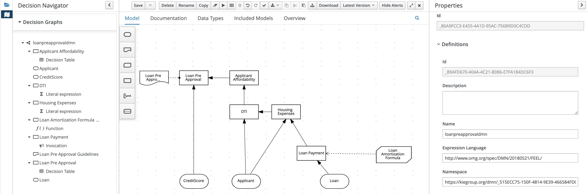
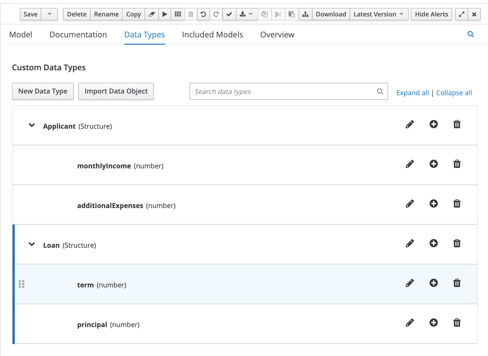
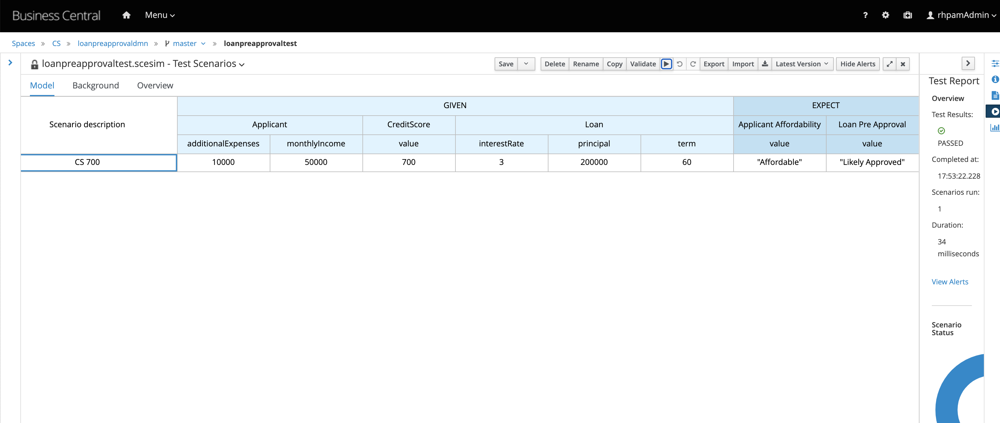

Introduction
=============
This project will demonstrate, DMN model with data types.

Versions
========
EAP: JBOSS 7.3.7

RHPAM: 7.10.1

DMN
===

DMN Data Types
==============

Test Scenarios
=======

To genearate executable DMN model use following command 
========================================================
mvn clean install -DgenerateDMNModel=yes
